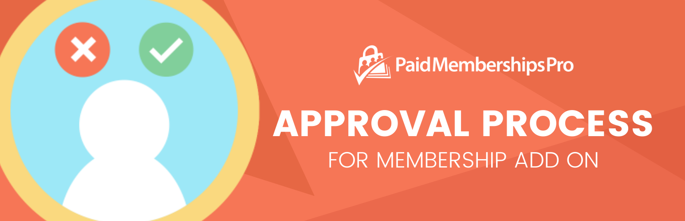

# [Approval Process for Membership](https://www.paidmembershipspro.com/add-ons/approval-process-membership/) #
[comment]: # (Generate badges from shields.io, only works for .org plugins to get other stats etc. We'd have to create our own endpoints for Premium plugins)

### Welcome to the Approval Process for Membership GitHub Repository
Grant membership site administrators the ability to approve or deny members. The Approvals Add On for Paid Memberships Pro allows you to set up a unique approval or application process for your membership site.

For more information please visit [https://www.paidmembershipspro.com/add-ons/approval-process-membership/](https://www.paidmembershipspro.com/add-ons/approval-process-membership/)

## Installation ##
For detailed installation steps, visit the [documentation](https://www.paidmembershipspro.com/add-ons/approval-process-membership/) page.

1. Download the current development ZIP file directly: `https://github.com/strangerstudios/pmpro-approvals/archive/dev.zip`

**Please ensure that once installing this version of the plugin to remove `-dev` from the plugin's folder name.**

## Bugs ##
If you find an issue/bug, let us know by [creating a detailed GitHub issue](https://github.com/strangerstudios/pmpro-approvals/issues/new).

## Support ##
This is a developer's portal for Approval Process for Membership. We do not offer support on this channel. **Any support related questions should be directed to [https://www.paidmembershipspro.com/add-ons/approval-process-membership/](https://www.paidmembershipspro.com/add-ons/approval-process-membership/).**

## Contributing to Approval Process for Membership ##
We encourage and welcome any contribution to Approval Process for Membership. Please read the [guidelines for contributing](https://github.com/strangerstudios/pmpro-approvals/blob/dev/.github/CONTRIBUTING.md) to this repository.

There are various **ways to the help development** of Approval Process for Membership:

1. Report [bugs/issues](https://github.com/strangerstudios/pmpro-approvals/issues/new) on GitHub.
2. Work on any issues by submitting a Pull Request.

Here are some ways for **non-developers to contribute** to Approval Process for Membership:

1. Translate Approval Process for Membership into your own [language](https://www.paidmembershipspro.com/paid-memberships-pro-in-your-language/).
2. [Purchase a plus membership](https://paidmembershipspro.com/pricing) to help fund ongoing development and bug fixes.
3. Leave an honest review for [Approval Process for Membership](https://www.paidmembershipspro.com/submit-testimonial/).
